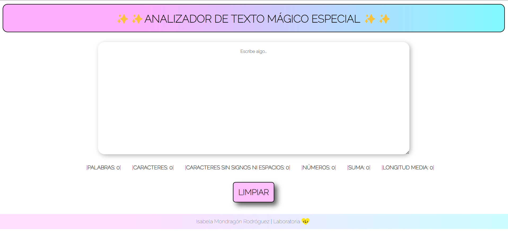
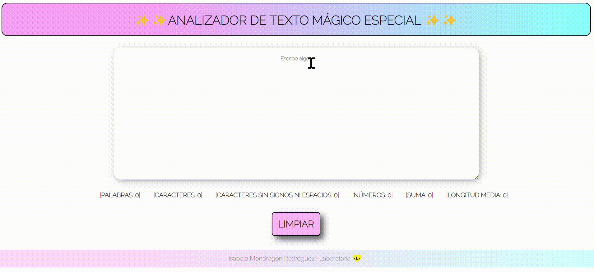

# ✨Text Analyzer ✨

------------
Text Analyzer es una aplicación sencilla y fácil de usar que permite a los usuarios analizar su texto en tiempo real. Con una interfaz simple, ofrece las siguientes funcionalidades:

- Palabras y caracteres en tu texto📚
- Caracteres, sin contar espacios 🧹
- Recuento de números🔢
- Suma total➕
- Longitud promedio de las palabras 📏
- Botón "Limpiar" ⌨️

#### Tabla de contenidos 

------------
1. Vista previa.
2. Características.
	3. analyzer.js 
4. Tecnologías utilizadas.
5. Recursos útiles. 

------------

#### Demo 

------------

#### Características

El proyecto consta de 4 documentos principales: **index.html, analyzer.js, index.js y style.css**. 

##### analyzer.js 
- *getWordCount(text)*: Esta función toma un texto como entrada y devuelve el número de palabras en el texto. Filtra el texto para eliminar espacios en blanco adicionales y caracteres no alfabéticos, y luego cuenta las palabras restantes.

- *getCharacterCount(text)*: Esta función toma un texto como entrada y devuelve el número total de caracteres en el texto, incluidos espacios y signos de puntuación.

- *getCharacterCountExcludingSpaces(text)*: Esta función toma un texto como entrada y devuelve el número de caracteres, excluyendo espacios y signos de puntuación. Utiliza una expresión regular para eliminar todos los caracteres que no sean letras y números, dejando solo las letras.

- *getAverageWordLength(text)*: Esta función toma un texto como entrada y devuelve la longitud promedio de las palabras en el texto. Primero, divide el texto en palabras y luego calcula la suma de las longitudes de todas las palabras. Finalmente, divide esta suma por el número total de palabras para obtener la longitud promedio.

- *getNumberCount(text):* Esta función toma un texto como entrada y devuelve la cantidad de números presentes en el texto. Utiliza una expresión regular para buscar y contar números válidos, incluidos números decimales.

- *getNumberSum(text)*: Esta función toma un texto como entrada y devuelve la suma de todos los números presentes en el texto. Utiliza una expresión regular para encontrar los números válidos y luego los suma todos.

------------
#### Tecnologías utilizadas

- HTML5: Proporciona la estructura básica de la aplicación.
- CSS3: Define el diseño y estilo visual de la aplicación.
- JavaScript: Implementa la funcionalidad para analizar el texto ingresado y mostrar los resultados.

------------
#### Recursos útiles 
[CSS Positioning Explained By Building An Ice Cream Sundae](http://https://www.freecodecamp.org/news/css-positioning-explained-by-building-an-ice-cream-sundae-831cb884bfa9/ "CSS Positioning Explained By Building An Ice Cream Sundae")
[Extended Syntax | Markdown Guide](http://https://www.markdownguide.org/extended-syntax "Extended Syntax")
[RegExr: Learn, Build, & Test RegEx ](http://https://regexr.com/ "Regex ")